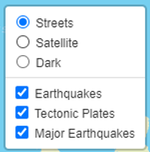

# Mapping Earthquakes

## Overview
This project was designed to visualize major earthquakes which occured over the last 7 days. 

## Results
The website shows a record of earthquakes based on their magnitude as can be seen below: 

The color scheme used, is shown in the legend on the map as well:

The map can furthermore be customized to view it in different views:
- Streets
- Satellite
- Dark

As an extra feature, a visualization of the *Tectonic Plates* was added. All layers can be removed or added, so that only the necessary information appears, or only the map. 

